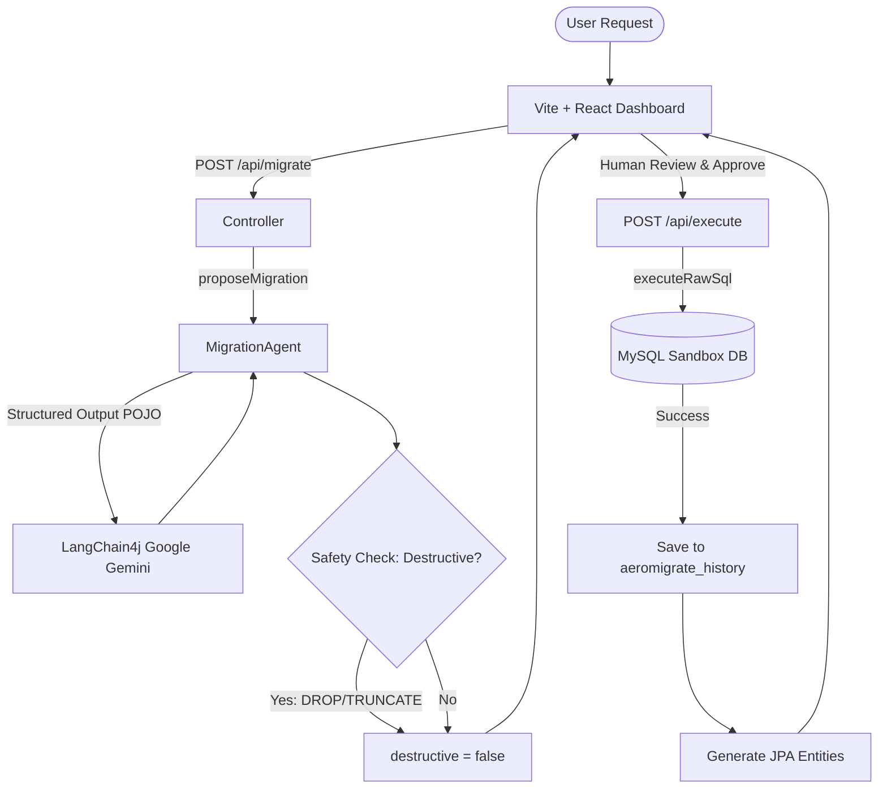

# AeroMigrate

> **Autonomous Database Migration & ORM Code Generation Agent**

[](https://www.oracle.com/java/)
[](https://spring.io/projects/spring-boot)
[](https://react.dev/)
[](https://www.mysql.com/)
[](https://github.com/langchain4j/langchain4j)

AeroMigrate is a self-contained, autonomous developer agent that transforms natural-language migration requests into database schemas and synchronizes them with modern Java JPA ORM entities. Built for enterprise teams who value safety, transparency, and speed, AeroMigrate integrates human-in-the-loop verification gates and strict structural validation checks to secure developer workflows.

---

## 🎥 Watch the Demo

Check out the Loom walkthrough video showcasing the two-step migration approval flow, the destructive change safety banner, the interactive React Flow ERD diagram, and the side-by-side Java class diff comparisons:

[**▶️ Watch AeroMigrate Showcase Walkthrough on Loom**](https://loom.com/share/placeholder-video-id)

---

## 🔍 Overview & The Problem

In fast-moving development lifecycles, maintaining alignment between database schemas (DDL) and backend object-relational mapping (ORM) classes is a constant friction point. Developers must manually write SQL migrations, apply them, and then translate those changes back into Java classes—leading to syntax errors, database constraint conflicts, and out-of-sync entities.

AeroMigrate solves this by introducing an **Agentic Developer Loop**:
1. **Natural Language Translation**: The agent interprets natural-language inputs (e.g., *"extract address into a separate table and associate users"*) into relational Up/Down DDL scripts.
2. **Context-Aware Proposals**: The agent queries MySQL's `INFORMATION_SCHEMA` dynamically to build a schema context, ensuring generated DDL aligns with existing columns, indexes, and foreign keys.
3. **Structured ORM Synthesis**: After a migration executes, the agent analyzes the new schema structure and automatically synthesizes Java JPA `@Entity` files, maintaining 100% alignment.

---

## ⚡ Key Features

*   **Human-In-The-Loop Approval Gate**: AI never runs SQL DDL statements directly against your database. AeroMigrate generates a structured Up/Down migration proposal, displaying the SQL to the developer for review and execution.
*   **Normalized Destructive Keyword Interceptor**: To prevent data loss, the agent runs a whitespace-normalized text scanner on proposed Up scripts. If keywords like `DROP TABLE`, `DROP COLUMN`, or `TRUNCATE` are detected, it locks execution until the developer checks an explicit safety banner box.
*   **Interactive React Flow ERD**: The static table inspector is replaced with an interactive Entity Relationship Diagram (ERD) canvas. Tables appear as custom cards displaying columns, highlighting **Primary Keys** (gold key) and **Foreign Keys** (links) with lines connecting relationships.
*   **Side-by-Side Java Entity Diffing**: When a migration is executed or rolled back, the dashboard compares the previous Java class against the newly generated ORM code, displaying color-coded additions and deletions side-by-side using JetBrains Mono fonts.
*   **One-Click Version History & Rollbacks**: Every migration applied is logged into the `aeromigrate_history` tracking table. Developers can review the history timeline and trigger database rollbacks using the generated Down DDL script with a single click.

---

## 🏗️ System Architecture

AeroMigrate splits execution logic into two phases:



### MySQL DDL Implicit Commit Handling
In MySQL, DDL statements (`CREATE`, `ALTER`, `DROP`) trigger an implicit transaction commit and cannot be rolled back. To maintain history integrity, AeroMigrate enforces a database-first order:
1. The DDL is executed against the database first.
2. The history record is written to the repository *only after* database execution succeeds.
3. If database execution fails, the history record is never written, preventing out-of-sync migration states.

---

## 🛠️ Tech Stack

*   **Frontend**: React.js (Vite), Tailwind CSS v4.0, `@xyflow/react` (React Flow), `react-diff-viewer-continued`, Lucide Icons.
*   **Backend**: Java 25, Spring Boot 3.3.0, Spring Data JPA, Hibernate, Jackson, Maven.
*   **Database**: MySQL 8.0 Community Server.
*   **AI Orchestration**: LangChain4j (0.35.0) for structured model mapping, supporting Gemini API & OpenAI.

---

## 🚀 Local Setup Instructions

### Prerequisites
Ensure you have the following installed on your system:
- Java JDK 17+ (Java 25 recommended)
- Apache Maven 3.8+
- Node.js (v20+) & npm
- MySQL Server 8.0 (community server)

---

### Step 1: Clone the Repository
```bash
git clone https://github.com/your-username/AeroMigrate.git
cd AeroMigrate
```

### Step 2: Initialize local MySQL Sandbox
AeroMigrate runs a local MySQL server process inside the workspace directory for sandboxing:
```powershell
# Create datadir
mkdir mysql_sandbox_data

# Initialize MySQL (Empty root password)
& "C:\Program Files\MySQL\MySQL Server 8.0\bin\mysqld.exe" --initialize-insecure --datadir=".\mysql_sandbox_data"

# Run MySQL Daemon in the background
& "C:\Program Files\MySQL\MySQL Server 8.0\bin\mysqld.exe" --datadir=".\mysql_sandbox_data" --port=3306 --console
```
Once started, run a check to create the database schema:
```powershell
mysql -u root -P 3306 -h 127.0.0.1 -e "CREATE DATABASE aeromigrate_sandbox;"
```

---

### Step 3: Configure and Start the Spring Boot Backend
1. Navigate to the backend folder:
   ```bash
   cd backend
   ```
2. Copy the template properties file:
   ```bash
   cp src/main/resources/application-example.properties src/main/resources/application.properties
   ```
3. Set your API Key in your terminal:
   ```powershell
   # On Windows (PowerShell)
   $env:GEMINI_API_KEY="your-gemini-api-key"
   
   # On Linux/macOS
   export GEMINI_API_KEY="your-gemini-api-key"
   ```
4. Build and start the backend server:
   ```bash
   mvn spring-boot:run
   ```
The backend server will launch on port `8081`.

---

### Step 4: Configure and Start the React Frontend
1. Navigate to the frontend folder:
   ```bash
   cd ../frontend
   ```
2. Copy the environment config template:
   ```bash
   cp .env.example .env.local
   ```
3. Install packages and start the Vite development server:
   ```bash
   npm install
   npm run dev
   ```
The frontend will start on port `5173`. Open **`http://localhost:5173/`** in your browser to start using AeroMigrate!
